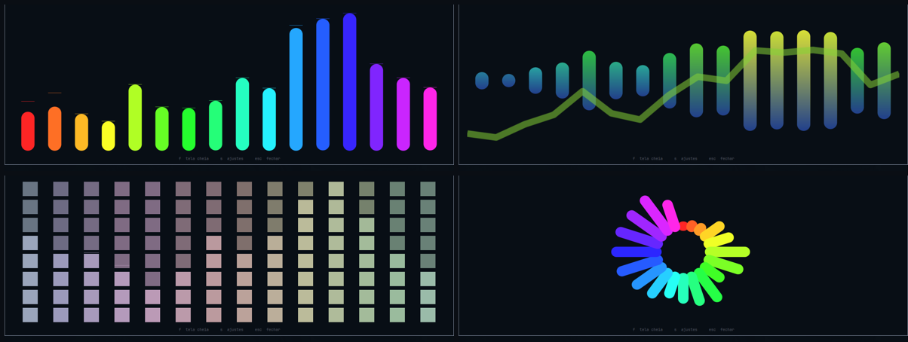

# Visualizer

The sound, in the Omarchy bar. Five shapes, six palettes, and the same colours
mirrored onto your WLED lights.



Four combinations of the same four axes.

It does not resolve a problem. It is an ornament, and the design assumes that:
every decision below chooses between *prettier* and *does not burn the
battery*, and the second one wins whenever it can.

## Install

```bash
omarchy plugin add \
  https://github.com/chameleonbr/omarchy_visualizer.git \
  --enable \
  --yes
```

Needs `cava`, which the plugin does not install for you:

```bash
omarchy pkg add cava
```

Without it the widget shows a crossed box and says so on hover, rather than
disappearing — a widget that shows nothing is indistinguishable from one that
failed to load.

## Styles

Four axes rather than a list of finished styles. They combine, so the shapes
people recognise from a reference sheet are arrangements of these rather than
fifteen separate things to maintain.

| Axis | Values |
|---|---|
| **base** | `bottom` · `top` · `mirror` · `radial` |
| **cap** | `flat` · `round` · `segments` |
| **fill** | `solid` · `barGradient` · `screenGradient` |

`solid` is one flat colour per bar. `barGradient` ramps every bar through the
whole palette range, normalised to its own length. `screenGradient` anchors
one ramp to the drawing area instead, so a quiet bar only ever reaches the low
end of it and a loud one covers the lot.

A palette that reads position rather than height — `rainbow`, `spectrum`, a
picked `solid` — has the same colour at both ends of a bar, so brightness
stands in for the height it has no opinion about. Every fill does something
visible in every palette.
| **extras** | peak markers · a wave underneath |

`radial` is a base like any other, so a full ring and an open fan are the same
geometry with a different `spread`.

The peak marker rises instantly and sinks slowly: the bars say what is happening
now, the markers say what just happened, and that is what makes a meter readable
at a glance.

## Palettes

| Palette | What it does |
|---|---|
| `accent` · `foreground` | the theme's colours, solid |
| `intensity` | foreground → accent as a band gets louder |
| `spectrum` | hue swept across the bands, **saturation from the theme** |
| `rainbow` | the same sweep at full saturation, ignoring the theme |
| `heat` | cold at rest, hot at the peaks |
| `gradient` | between two colours you pick |
| `solid` | one colour you pick |
| `urgent` | accent, turning urgent above the threshold |

Two families on purpose: `intensity`, `heat` and `urgent` move with the sound;
`spectrum`, `rainbow` and `gradient` are fixed to position. One gives colour
motion, the other keeps the bar visually still.

`spectrum` takes its saturation from the theme, so a muted theme gets a muted
sweep. `rainbow` is the loud version, and having both is the point.

## The stage

Click the widget and the spectrum gets a window of its own.

| Key | What it does |
|---|---|
| `b` `c` `f` `p` `i` `e` `w` `a` `l` `r` `g` | cycle one setting, while the pane is open |
| `shift` + any of those | cycle it backwards |
| `1` `2` `3` | open the colour picker for the row of that number |
| `s` | settings, beside the spectrum |
| `esc` | steps back one layer — out of the settings, then closed |

The stage is an ordinary window titled `Visualizer`. Whether it tiles, floats,
where it opens and how big — that is your compositor's job, and you already
have rules and keybinds for it. Under Hyprland:

```
windowrule = float, title:^(Visualizer)$
windowrule = size 900 400, title:^(Visualizer)$
windowrule = center, title:^(Visualizer)$
```

Fullscreen is your compositor's too — Omarchy binds it to `super` + `F` — so
the plugin claims no key for it and every letter is free for the settings.
`omarchy-shell avila.visualizer fullscreen` is there if you would rather bind
your own.

The settings open **beside** the spectrum, not over it — every control in them
is previewed by the visualiser next to it, so covering it would defeat the
point. On a narrow screen they go underneath instead.

Every row cycles on click, left forward and right back. There is no apply
button.

Windowed, the stage is a floating card the size of its own content: the rest of
the screen carries on working, and you can click other windows while it is up.
It takes the keyboard only for a moment when it opens, so `f` and `s` work right
away; after clicking elsewhere, click the card again to use them.

**Colours**: the palettes that read a colour — `solid` and `gradient` — get a
picker in the settings, with a saturation square, a hue strip and an editable
hex. The hex commits on Enter rather than on every keystroke, because `#ff` is
a valid prefix of a colour someone is still typing.

It can be bound too:

```bash
omarchy-shell avila.visualizer toggle
omarchy-shell avila.visualizer fullscreen
omarchy-shell avila.visualizer settings
```

## Where it listens

| `input` | What it hears |
|---|---|
| `system` | what the machine is playing |
| `mic` | the microphone |
| `both` | the two summed together |

`both` is not a cava setting: cava reads one device, and a device that hears
both does not exist. The plugin builds one — a null sink fed by two loopbacks —
while the setting is on, and removes it when you change it or the shell exits. A
stray sink left in someone's audio graph outlives the widget.

## Settings live in their own file

`~/.config/omarchy/visualizer.json`. The bar host has no way for a widget to
write its own `shell.json` entry, and a plugin editing that file races the shell
whenever the bar is dragged. The `shell.json` entry seeds the defaults; the
file wins.

## What it costs you## What it costs you

This runs on a laptop, so the guards are most of the design.

**The process is killed, not paused.** A paused cava still holds the audio
capture open, which is most of what it costs. It stops when nothing is playing,
when you are on battery, and when no copy of the widget is on screen. Each of
those is a setting, and each is on by default.

**30 frames a second, not 60.** At the size of a bar the difference is
invisible; in the power draw it is not.

**The width never changes.** A visualiser whose width followed the sound would
shove every widget to its right across the bar on every frame.

At rest the shape is still drawn, flat and dimmed. The widget keeps its place
rather than collapsing and reflowing everything beside it.

## WLED

Turn on `wled` in the settings pane and the lights configured for the
[WLED plugin](https://github.com/chameleonbr/omarchy_wled) show the colour the
bar is showing. That file is read, never written — it belongs to that plugin.

The pane grows five rows when that file names a light: whether the bridge is
on, which mode, which light to drive, how fast, and whether to put it back
when the music stops. `devices` cycles through the names from that file — the
ones their owner gave them, untranslated — and `all` means every light it
lists.

### Modes

A strip is not a lamp, and sending it one colour throws away the only thing it
can do that a bulb cannot.

| Mode | What the strip shows |
|---|---|
| `spectrum` | the bands laid along the strip, low at one end, each lit by how loud it is |
| `mirror` | the same, folded so the low bands meet in the middle and travel out to both ends |
| `solid` | one colour for the whole strip, brightness following the mean — what a bulb wants |

The strip is asked how long it is once, when the bridge starts, and painted in
runs rather than one colour per LED: fourteen `[start, stop, colour]` triplets
is a payload a device with a few hundred kilobytes of RAM can read ten times a
second; three hundred hex strings is one it drops. Until it answers, and for a
single bulb, every mode falls back to `solid` — the bridge works from the
first frame and sharpens once the strip has spoken.

A band at rest is dim, never black. A dark stretch of strip reads as a fault
rather than as quiet.

Three things this gets right, and they are all about the hardware:

**Brightness follows the mean, not the peak.** Tracking the peak makes the lamp
follow the kick drum alone, which reads as strobing rather than as music.

**Frames above `wledRateHz` are dropped, never queued.** WLED over HTTP stops
answering long before a frame rate, and the symptom looks like a broken lamp
rather than a busy one. A queue would only move the backlog to the end of the
song.

**The lights are put back when the music stops.** Leaving a lamp frozen on some
colour after you close the player is the worst thing this bridge can do.

A light that does not answer never holds up a frame: the sends are detached, and
a failure there never touches what the bar draws.

## Settings

Everything is in the widget's settings screen. The ones worth knowing:

| Setting | Default | Why you might change it |
|---|---|---|
| `base` · `cap` · `fill` · `palette` | `bottom` · `flat` · `solid` · `accent` | taste |
| `barCount` | 14 | more bands, finer detail, more to draw |
| `smoothing` | 60 | how gently a bar falls; the rise is always immediate |
| `floor` | 3 | below this a band reads as zero, so room noise lets it rest |
| `framerate` | 30 | the cost knob |
| `pauseWhenSilent` · `pauseOnBattery` | on | the two guards |
| `wledEnabled` | off | mirror onto the lights |
| `wledRateHz` | 10 | how fast the lamp is asked to follow |
| `wledDevices` | all | narrow the bridge to one light |
| `wledStyle` | `spectrum` | how the strip is painted |

## Development

```bash
node test_visualizer.js
```

35 checks, no framework, no audio, no cava, no network. See `CLAUDE.md` for how
the pieces fit and `SPEC.md` for why they are shaped this way.

## License

MIT

## Language

Everything the plugin says is translated, and English is the default. `auto`
follows `LANG` and falls back to English for anything not translated rather
than guessing at a near neighbour; `en` and `pt` force one. The setting is in
the pane, so switching it is one click and takes effect immediately.

Adding a language is one entry in `I18n.js`. The checks fail if it is missing
a key English has, or has one English does not, or leaves any setting value
without a word.

## The keyboard

Open the pane with `s` and every row has a letter, painted in the accent
colour inside its own label:

| Key | Row | Key | Row |
|---|---|---|---|
| `b` | base | `r` | fps |
| `c` | cap | `g` | language |
| `f` | fill | `d` | wled |
| `p` | palette | `v` | devices |
| `i` | input | `m` | wled mode |
| `e` | peak | `t` | wled rate |
| `w` | wave | `o` | restore on stop |
| `l` | fall | `a` | bars |

The last five are only there when the WLED plugin's config names a light, and
so are their letters: on a machine with no lights `d` does nothing rather than
flipping a setting nobody can see.

Hold `shift` to walk an axis backwards, which is what makes a nine-value
palette usable from the keyboard. `1`, `2` and `3` open the colour picker for
the colour rows in the order they appear — the palette decides how many there
are, so `1` is always the first one on screen.

The letters do not move when you change language. Muscle memory outlives a
translation table, so `fps` shows `fps (r)` in English and Portuguese alike
where the label has no `r` of its own to paint.

## Where it writes

Two files, both yours:

- `~/.config/omarchy/visualizer.json` — your settings.
- `$XDG_RUNTIME_DIR/omarchy-visualizer/cava.conf` — the config cava is started
  with, in a directory created `0700`, falling back to `~/.cache` and to not
  running at all rather than to a shared directory like `/tmp`.

It never touches `~/.config/cava`. That file belongs to whoever runs cava in a
terminal, and a bar widget has no business rewriting it.

It reads one more, `~/.config/omarchy/wled.json`, which the WLED plugin owns.

Both of the files it reads go through `SizedFile`, which reads through a
ceiling rather than measuring against one: at most 64 KiB plus the byte that
proves the file was bigger, so what arrives is bounded whatever the file does
while it is being read. Over that, the last good settings stand. The shell
outlives every window in it, so anything it reads it keeps — and the device
list in `wled.json` is scanned to a fixed depth for the same reason. Trim the
file and it loads again on the spot; no restart.
